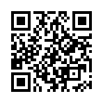

# Proposal for 2D barcode for France's CTC

During the [JFE 2026](https://jfe.fnfe-mpe.org/) event on May 5-6th 2026, one of the main talks mentionned the idea of a 2D barcode to transmit the company's e-invoicing address to the cashier, but this was just an idea and there was no spec available for it. France's CTC reform is starting on September 1st 2026, so we should move forward rapidly on this. Here is a proposal to normalize a 2D barcode to easily transmit the e-invoicing address from the customer to the cashier, as well as a few other parameters that could be useful for the customer company that will receive the invoice.

## Data in 2D barcode

| EN16931 field            | EN16931 code | Required?    |
|:-------------------------|:-------------|:-------------|
| Buyer electronic address | BT-49        | **Required** |
| Buyer reference          | BT-10        | *Optional*   |
| Project reference        | BT-11        | *Optional*   |
| Contract reference       | BT-12        | *Optional*   |
| Purchase order reference | BT-13        | *Optional*   |

## Data encoding

The barcode content is made of 2 parts:
* a prefix <code>FRCTC</code>
* data expressed as [JSON](https://en.wikipedia.org/wiki/JSON):
  * Keys are EN16931 codes or, to save characters, only the numeric part of the EN16931 code. For example, key <code>49</code> stands for <mark>BT-49</mark>.
  * Values must be strings.
  * To save characters, it is recommended to avoid adding a space after the semi-colon and after the coma i.e. use <code>{"49":"820123354","11":"JFE2026"}</code> instead of <code>{"49": "820123354", "11": "JFE2026"}</code>

The sample QR code above contains the following characters:

~~~~
FRCTC{"49":"820123354_FRAIS","11":"JFE2026"}
~~~~

These characters mean:
* my electronic address (BT-49) is <code>820123354\_FRAIS</code>. Reminder: the electronic address is the identifier of the [directory](https://facturation.chorus-pro.gouv.fr/) line on which I want to receive the invoice. In this exemple, the [SIREN](https://fr.wikipedia.org/wiki/Syst%C3%A8me_d%27identification_du_r%C3%A9pertoire_des_entreprises) is <mark>820123354</mark> and the suffix is <mark>FRAIS</mark>.
* project reference (BT-11) is <code>JFE2026</code>

By reading this barcode, the point of sale software will have all the information it needs to generate a flow 2 to the accredited platform. With the electronic address that start with the SIREN, it can retreive the name of the company from the PPF directory with a single HTTP GET request on <mark>/v1/siren/code-insee:{siren}</mark> ([AFNOR API](https://www.boutique.afnor.org/fr-fr/norme/xp-z12013/-api-pour-interfacer-les-systemes-dinformations-des-entreprises-avec-les-pl/fa300084/466438)).

## Sample Python code

This GitHub repository provides 2 Python scripts:

* <code>fr\_ctc\_barcode\_generate.py</code> to generate a 2D barcode
* <code>fr\_ctc\_barcode\_read.py</code> to parse the string outputed by the barcode reader

To install the required dependencies, run:

~~~~
pip install -r requirements.txt
~~~~

To know how to use these scripts, launch them with the option **--help**.

To run the test suite, run:

~~~~
python -m unittest tests.py
~~~~

## Comments and change proposals

You can open an issue or a pull request on this GitHub project to give your opinon on this proposal and propose changes.

## Motivations for technical choices

To make this proposal, I used my experience implementing different barcode and text-based protocols such as [GS1 barcodes](https://ref.gs1.org/standards/genspecs/), the [protocol between payment terminal and cashier software of the Association du Paiement](https://associationdupaiement.fr/protocoles/protocole-caisse/). I also studied the [Wifi configuration barcode standard](https://github.com/zxing/zxing/wiki/Barcode-Contents#wi-fi-network-config-android-ios-11) and made some research on different data encoding formats for barcodes.

First, it is important to understand that 2D barcodes can store several thousands characters (and these characters can by any unicode character), but, if the barcode has a lot of characters, it will be more complex to read for barcode scanners and it will have a performance impact when reading the barcode with the barcode scanner. So my guideline for the spec is: make the barcode content as short as possible, but not at the expense of complexity for software implementation (parsing and generation).

The main topic is how to separate the different blocks of data when the values have a variable length. GS1 barcode uses the [FNC1 character](https://www.gs1uk.org/knowledge-hub/barcodes/what-is-the-function-1-character), which is a barcode-only character which doesn't exist in the unicode table ; at first, it seems a good idea to use a character that cannot be used in the data values, but it just moves the technical problem downstream to the text representation of the barcode outputed by the barcode reader, where the user must configure the text representation of FNC1 and this configuration process is different from a barcode manufacturer to another. In real-life, it's a big pain because the barcode reader need to have a specific configuration, which causes many operational problems when the barcode reader needs to be replaced.

Other protocols like the protocol between payment terminal and cashier software of the Association du Paiement, the length of each value is given before the value itself and field identifiers have a fixed-length. It is easy to implement in code, but the string is difficult to read for a human, which makes debugging less easy. And EN16931 field codes (<mark>BT-1</mark>, <mark>BT-10</mark>, <mark>BT-112</mark>) don't have a fixed length.

In my initial version of this spec, I adopted the standard of the Wifi configuration barcode standard. I initially thought it was the perfect choice: easy to read by a human, minimum number of characters, simple generation code. But parsing requires complex code that is error-prone, cf the [first implementation](https://github.com/akretion/fr-ctc-2d-barcode-demonstrator/blob/6029f08f5b83fb8bae3e66c83adce8dd068b2c99/fr_ctc_barcode_read.py#L50) of the script <mark>fr\_ctc\_barcode\_read.py</mark>. It is important to keep the software implementation as simple as possible: reliability comes with simplicity!

In the end, I think using JSON is the best balance between simplicity of generation/parsing and number of characters used in the barcode. JSON will use a bit more characters than the Wifi configuration barcode standard, but the overhead in the number of characters is small whereas the code for parsing is much simpler. JSON generation and parsing is natively available in all the programming languages, so there is no risk of bad/buggy software implementation.

The implementation proposed here has the following advantages:
* very easy to read by a human, which makes the standard easy to understand and easy to debug,
* generation and parsing is easy to implement with native libs in all programming languages: no risk of bad/buggy software implementations,
* no special configuration needed on barcode scanners.

Small drawback: JSON has a small character overhead. This small drawback is mitigated by the fact that the spec recommends not to use space after coma in JSON, to use short keys (for example: <mark>49</mark> for <mark>BT-49</mark>) and use a short prefix (FRCTC).

## Left to decide to finalize the standard

* Format of the 2D barcode: [QR Code](https://en.wikipedia.org/wiki/QR_code), [Datamatrix](https://en.wikipedia.org/wiki/Data_Matrix), [Aztec](https://en.wikipedia.org/wiki/Aztec_Code), ...
* Exact list of the optional EN16931 fields
* Oblige to use short keys (for example: <mark>11</mark> for <mark>BT-11</mark>) instead of a recommandation ?
* Prefix **FRCTC**

## About

To know more about the motivations behind this proposal, read [this blog post](https://www.linkedin.com/pulse/ma-proposition-de-norme-qr-code-pour-le-invoicing-en-alexis-de-lattre-so8ce) (in French).

## Contributors

* Alexis de Lattre \<<alexis.delattre@akretion.com>\>
